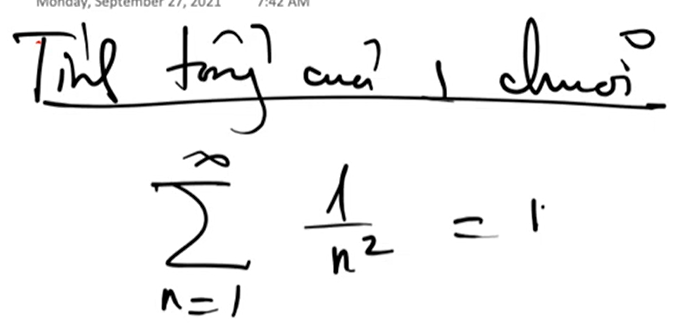
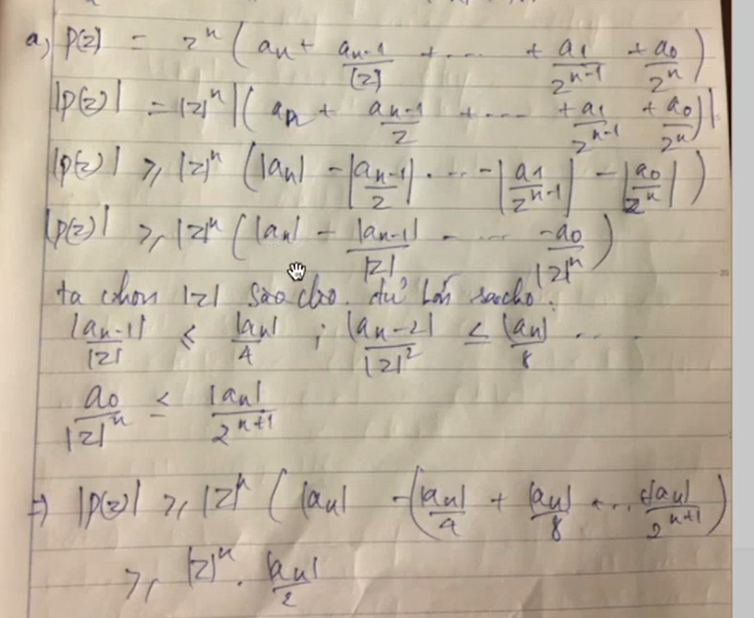

# Các công thức học lại

Lượng giác: Công thức như CTG, Đạo hàm, Nguyên hàm

Chuỗi Taylor

Công thức tính tiêu điểm elip

# Chứng minh

đa thức có n nghiệm

đa thức có nghiệm z thì có z ngang

đa thức là tích bậc 1 với bậc 2

chứng minh bất đẳng thức tam giác

# ==============

<!--  -->
<!--  -->
<!--  -->
<!--  -->
<!--  -->

# ==============

<!--  -->
<!--  -->
<!--  -->
<!--  -->
<!--  -->
<!--  -->
<!--  -->

# ==============

<!--  -->

# ==============

Kiến thức lượng giác

Lưu ý: Không được tách thành tổng các phân số để xét
Vì :

=> Dùng chuỗi Taylor để đánh giá và tách cho biểu thức đằng sau

<!--  -->
<!--  -->
<!--  -->
<!--  -->

<!--  -->
<!--  -->

# ==============

# ==============

<!--  -->

<!--  -->

<!--  -->

<!--  -->

<!--  -->

# ==============

<!--  -->
<!--  -->

<!--  -->
<!--  -->
<!--  -->
<!--  -->

# ==============

<!--  -->
<!--  -->
<!--  -->
<!--  -->
<!--  -->
<!--  -->

<!--   -->

# ==============

# ==============

# ==============

# ==============

# ==============

# ==============

# ==============

# ==============

Căn nguyên thủy...1,c

Định nghĩa sin, cos???????

Chứng minh sin cos không bị chặn 1

Hyperpolic

# ==============

Bài tập chương 1

Bài 1
dễ

Bài 2
dễ

Bài 3

Cách làm
Cho x(t)= phần thực
Cho y(t)= phần ảo
Tìm mối quan hệ của x,y
Vẽ đồ thị
a

b

c

d

Bài 4
Cách làm
Cho x(t)= phần thực
Cho y(t)= phần ảo
Tìm mối quan hệ của x,y
a

b

c

d

Chứng minh tương tự nhưng ngược chiều

Bài 5

Bài 6
Giải nghiệm sin z=0

Bài 7

Bài 8

Bài 9

Bài 10
ok

Bài 11
khó

Bài 12

# ==============

<!-- Tìm file của phân tán -->

<!--  -->
<!--  -->
<!--  -->
<!--  -->
<!--  -->
<!--  -->
<!--  -->
<!--  -->
<!--  -->
<!--  -->
<!--  -->
<!--  -->
<!--  -->
<!--  -->
<!--  -->
<!--  -->
<!--  -->
<!--  -->
<!--  -->

<!--  -->
<!--  -->
<!--  -->
<!--  -->
<!--  -->
<!--  -->
<!--  -->
<!--  -->
<!--  -->
<!--  -->
<!--  -->
<!--  -->
<!--  -->
<!--  -->
<!--  -->
<!--  -->
<!--  -->
<!--  -->
<!--  -->
<!--  -->
<!--  -->
<!-- Bỏ qua topo -->
<!--  -->

<!--  -->

<!-- Bỏ qua topo -->

VD:

xác định ảnh:

<!-- phân loại vở và ghi âm -->

<!--  -->

