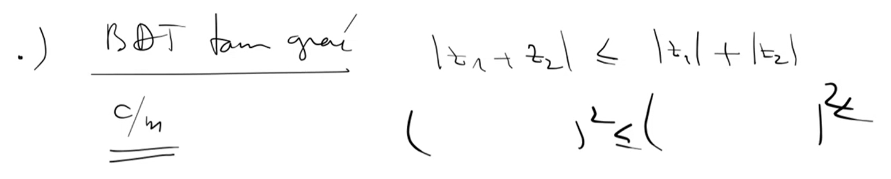
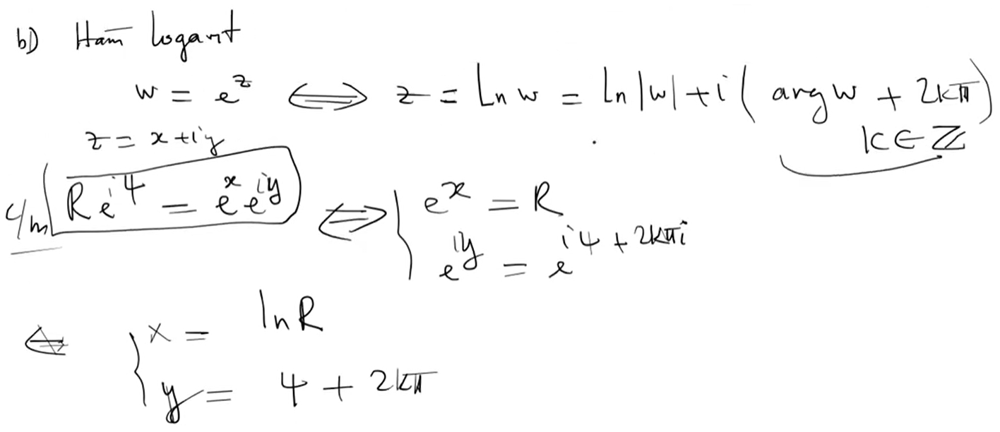

# Các công thức học lại

Kiến thức lượng giác

Dùng chuỗi Taylor để đánh giá

# Chứng minh

đa thức có n nghiệm

đa thức có nghiệm z thì có z ngang

đa thức là tích bậc 1 với bậc 2

chứng minh bất đẳng thức tam giác

# ==============

# ==============

# ==============

# ==============

Kiến thức lượng giác

Lưu ý: Không được tách thành tổng các phân số để xét
Vì :

=> Dùng chuỗi Taylor để đánh giá và tách cho biểu thức sau

# ==============

# ==============

# ==============

# ==============

# # ==============

# # ==============

# # ==============

# # ==============

# # ==============

# # ==============

# ==============

# ==============

# ==============

# ==============

# ==============

# ==============

# ==============

# ==============

Căn nguyên thủy...1,c

Định nghĩa sin, cos???????

Chứng minh sin cos không bị chặn 1

Hyperpolic

# ==============

Bài tập chương 1

1

2

3

Công thức tính tiêu diểm elip

4

5

6
??????????

7

8

9

10

11
khó

# ==============
